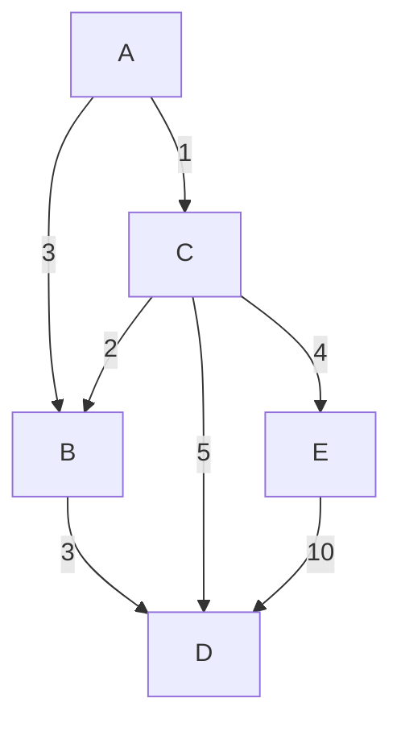

# Parcial nocturno 2026 mayo

## Ejercicio 1

### a

Verdadero.

La unica excepcion es que haya elementos cuya prioridad sea igual, pero en ese caso de todas formas el elemento en la raiz sigue siendo
uno de los de menor prioridad.

### b

Falso.

El algoritmo de Bellman-Ford recorre aristas repetidamente, mientras que el algoritmo de Dijkstra utiliza la cola de prioridad para
seleccionar el siguiente vértice (siendo esto una recorrida).

### c

Falso.

Floyd se puede utilizar para encontrar ciclos negativos en un grafo, si yo hago el algoritmo y luego reviso la diagonal de la matriz de distancias, cualquier valor negativo en la diagonal indica un ciclo negativo. Otra forma de verificarlo es seguir iterando mas veces el algoritmo y ver si alguna distancia sigue disminuyendo.

### d

Falso.

$\lambda$ representa el porcentaje de llenado del array. No puede exceder el 100%.

### e

Falso.

Dos pasadas de BFS/DFS no es suficiente para encontrar si un grafo es débilmente conexo. El resto de los casos SI se puede verificar con estas pasadas.

Si para la segunda pasada de BFS/DFS armamos el grafo subyacente (ignorando la dirección de las aristas), entonces sí podemos determinar si el grafo es débilmente conexo.

## Ejercicio 2

### a



### b

A->B

E->D

C->D

### c

No es unico, por ejemplo puedo ir de A->B con el mismo costo

## Ejercicio 3

Cambio un poquito la firma para no usar referencias, que no me gustan

```c++

struct arista {
   int destino;
   int peso;
};

struct resultado {
   list<int>* depositosPorRed;
   list<int>* paresPorRed;
   int cantidadRedes;
};


resultado infoRedes(grafo * g){
   resultado res;
   res.depositosPorRed = new list<int>();
   res.paresPorRed = new list<int>();
   res.cantidadRedes = 0;

   // hago BFS hasta recorrer todas las componentes conexas
   bool *visitados = new bool[g->cantidadVertices()];
   for(int i = 0; i < g->cantidadVertices(); i++){
       visitados[i] = false;
   }

   for(int i = 0; i < g->cantidadVertices(); i++){
       if(!visitados[i]){
           queue<int> * q = new queue<int>();
           q->push(i);
           visitados[i] = true;
           int cantidadVerticesComponente = 0;
           int cantidadParesComponente = 0;

           cantidadVerticesComponente++;
           if (i % 2 == 0) {
            cantidadParesComponente++;
           }

           while(!q->empty()){
               int v = q->pop();
               // recorrer los vecinos de v
               iterator<arista> * it = g->obtenerAdyacentes(v);
               while(it->hasNext()){
                   int vecino = it->next().destino;
                   if(!visitados[vecino]){
                       visitados[vecino] = true;
                       cantidadVerticesComponente++;
                       if (vecino % 2 == 0) {
                           cantidadParesComponente++;
                       }
                       q->push(vecino);
                   }
               }
           }

           res.depositosPorRed->add(cantidadVerticesComponente);
           res.paresPorRed->add(cantidadParesComponente);
           res.cantidadRedes++;
       }
   }
   return res;
}

```
